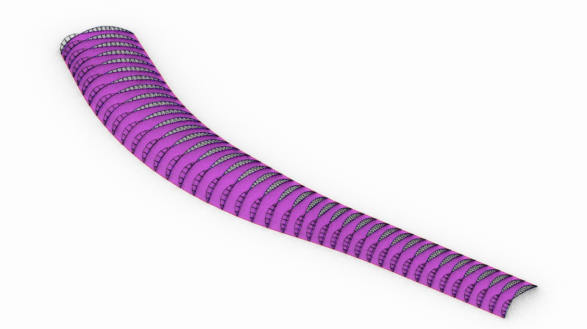

# Estación de Waterloo

[Lámina](../laminas/L3%20Grimshaw_LR.pdf)

[Modelo](../modelos/GC_M2_WATERLOO2.gh)

[Modelo Interactivo](https://www.shapediver.com/app/models/waterloo-station)

La estación internacional de Waterloo fue construida en 1994. Consta de una bóveda de cañon compuesta por arcos de armaduras tridimensionales. Estos arcos son curvas de tres articulaciones entre dos segmentos, ambos segmentos tienen diferente radio, y la forma de la bóveda se adapta al sitio y a la geometría de la estación de tren.  

Este modelo paramétrico traza los arcos dobles a partir de dos curvas principales. Y a partir de ellos traza las armaduras tridimensionales. 

