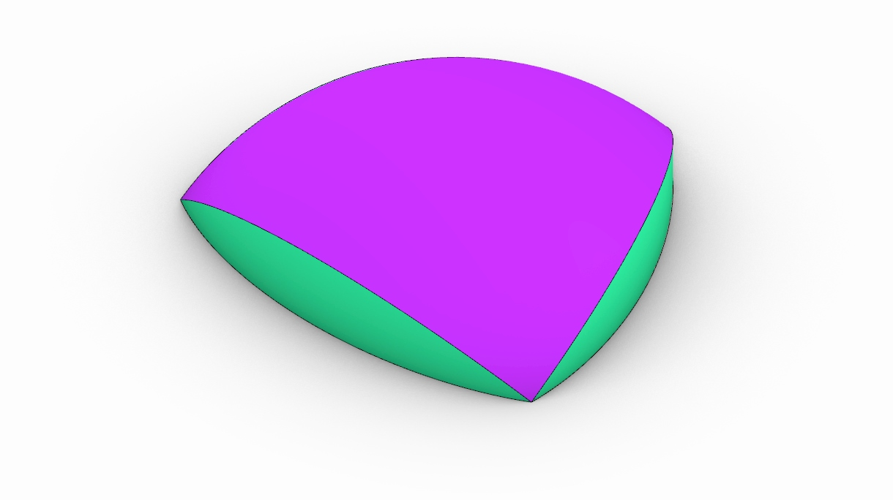

# Kresge Auditorium

El auditorio Kresge se encuentra en el campus principal del Massachusetts Institute of Technology en Cambridge. Fue construido en 1955 y consta de un domo con forma de un cuarto de esfera apoyado en sus esquinas. 

