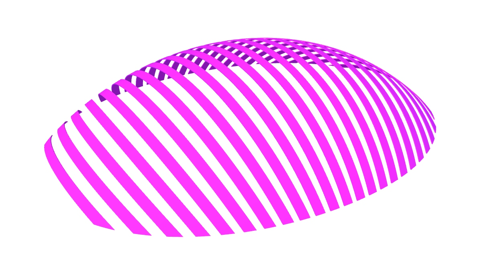

# Atsushi Imai Memorial Gym

[Lámina](../laminas/L1%20Shigeru_LR.pdf)

[Modelo](../modelos/GC_M1_ATSUSHI%20IMAI.gh)

Este proyecto fue construido en 2002 y consta de un domo toroidal de 20 x 20m. 
El modelo paramétrico se produjo a partir de una generatriz y una directriz circulares. 
A partir de estas, se traslada la generatriz a lo largo de la directriz, y se utilizan estas curvas para producir las superficies regladas que componen el sistema.  

