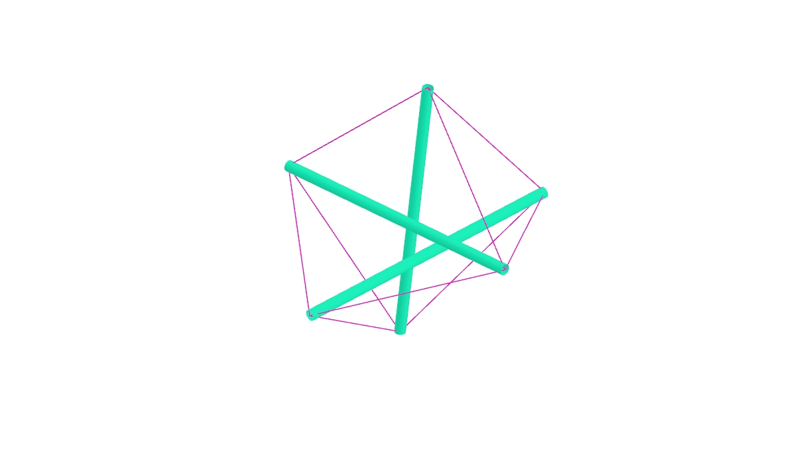

# Atsushi Imai Memorial Gym

La Tensegridad es un principío de diseño de las estructuras en las que todos los elementos se encuentran sometidos a compresión o tracción pura. esto permite producir estructuras altamente eficientes por medio del entrelazamiento y cruzamiento de tensores entre elementos a compresión. 
